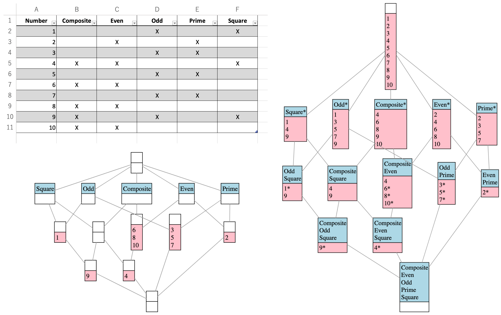
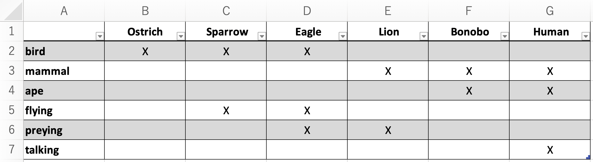
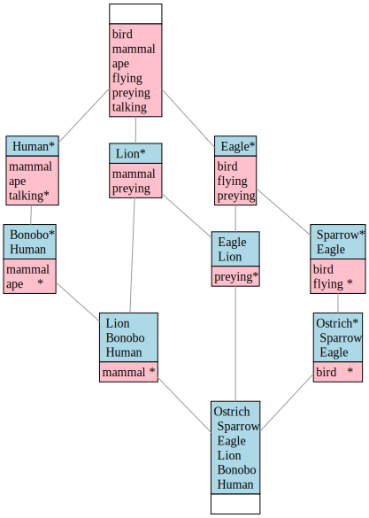
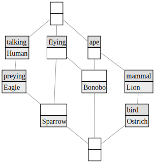
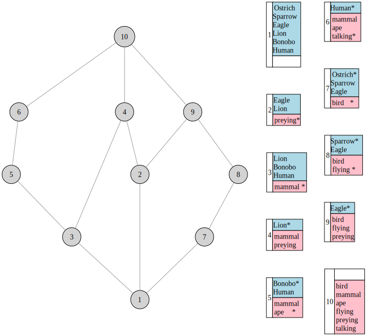

# 💭 RubyFCA

Command line tool for Formal Concept Analysis (FCA) written in Ruby.



## Change Log

- More test cases added [June 19, 2023]
- Microsoft Excel `.xlsx` files supported [June 18, 2023]

## Features

* Converts data in XLSX (Microsoft Excel), CSV (comma-separated values), or CXT ([Conexp](https://github.com/fcatools) and generate a Graphviz DOT file, a SVG/EPS vector image file, or /a PNG/JPG bitmap file.
* Adopts the Ganter algorithm (with reference to its Perl implementation of [Fcastone](https://upriss.github.io/fcastone) by Uta Priss).

## Dependencies

- [Graphviz](https://graphviz.org/)

For example, to install Graphviz using Homebrew on MacOS, execute the following command 

    brew install graphviz

## Installation

Install the gem:

    gem install rubyfca

## How to Use

    RubuFCA converts Conexp CXT data to Graphviz dot format.
    
    Usage:
           rubyfca [options] <source file> <output file>
    
    where:
    <source file>
           ".xlsx", ".csv" ,".cxt"
    <output file>
           ".svg", ".png", ".jpg", ".eps", or ".dot"
    [options]:
              --full, -f:   Do not contract concept labels
      --coloring, -c <i>:   Color concept nodes [0 = none (default), 1 =
                            lightblue/pink, 2 = monochrome] (default: 0)
          --straight, -s:   Straighten edges (available when output format is
                            either png, jpg, svg, pdf, or eps)
       --nodesep, -n <f>:   Size of separation between sister nodes (from 0.1 to
                            5.0) (default: 0.4)
       --ranksep, -r <f>:   Size of separation between ranks (from 0.1 to 5.0)
                            (default: 0.2)
            --legend, -l:   Print the legend of concept nodes (available only when
                            using circle node shape)
            --circle, -i:   Use circle shaped concept nodes
           --version, -v:   Print version and exit
              --help, -h:   Show this message

## Examples

### Input Data

#### XLSX (Excel)

<kbd>
    
</kbd>

#### CSV

```
        , Ostrich , Sparrow , Eagle , Lion , Bonobo , Human being
bird    , X       , X       , X     ,      ,        ,  
mammal  ,         ,         ,       , X    , X      , X
ape     ,         ,         ,       ,      , X      , X
flying  ,         , X       , X     ,      ,        ,  
preying ,         ,         , X     , X    ,        ,  
talking ,         ,         ,       ,      ,        , X
```

#### CXT

```
B

6
6

Ostrich
Sparrow
Eagle
Lion
Bonobo
Human being
bird
mammal
ape
flying
preying
talking
XXX...
...XXX
....XX
.XX...
..XX..
.....X
```

## Output

`rubyfca input_file output_file --coloring 1 --full --nodesep 0.8 --ranksep 0.3 --straight`



`rubyfca input_file output_file --coloring 2 --nodesep 0.5 --ranksep 0.3`



`rubyfca input_file output_file --circle --legend --coloring 1 --full --nodesep 0.8 --ranksep 0.3 --straight`



## Authors

- [Yoichiro Hasebe](https://github.com/yohasebe) 
- [Kow Kuroda](https://github.com/kow-k)

## License

See LICENSE for details.
